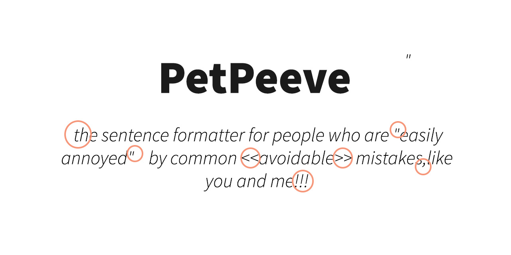

<p align="center">
      
</p>
<p align="center">
    <i>Petpeeve.js lets you correct the most common typographic errors and automagically normalize your strings according to sane formatting rules.</i>
    <br />
    <br />
    
    
    
    
</p>

# Usage

_Trigger warning_: Doesn't it also annoy you when people forget spaces after their punctuation,or make horrible capitalization mistakes? well, fear no more: this library is made for the likes of us.

In its essence, the library is an extensible set of function that correct the most common (and detectable) typographical and formatting mistakes people make when writing sentences, it is best used when you rely on user-submitted content but you still want your app to maintain a certain degree of consistency or even cleanliness.

Its basic usage is like so:

```typescript
import PetPeeve from "petpeeve"

const corrector = PetPeeve();

corrector("Gosh!this sentence does    not look nice!!");
// Outputs: Gosh! This sentence does not look nice!
```

## Operations

PetPeeve performs a variety of operations, which can be optionally enabled or disabled according to your needs. `PetPeeve` accepts an `options` object, of which the keys are the functions you want to enable or disable, and the values are `booleans`.

You can use this in two ways:

1. If all the values you pass are `false`, then PetPeeve will enable all the operations *except the ones you have disabled*.
2. Otherwise, PetPeeve will only perform the operations you have whitelisted.

The function returned by PetPeeve, accepts an extra optional argument if you ever want to change the options for one operation.

```typescript
const corrector = PetPeeve({
  capitalizeSentences: false,
  removeExtraPunctuation: false 
});

corrector("Gosh!this sentence    does not look nice!!");
// Outputs: Gosh! this sentence does not look nice!!

corrector(
  "Gosh!this sentence    does not look nice!!",
  { removeExtraSpaces: true }
);
// Outputs: Gosh!this sentence does not look nice!!
```

Here is a list of the available operations:

### capitalizeSentences

Tries to detect sentences and capitalizes them.

* Always capitalizes the beginning of a string. E.g. _beginning capitalization_ → _Beginning capitalization._
* Capitalizes after appropriate punctuation marks (., ? and !). E.g. _I am excited! what about you?_ → _I am excited! What about you?._
* Capitalizes after newlines. E.g.
    ```
    This is a sentence
    presumably this is another.
    ```
    →
    ```
    This is a sentence
    Presumably this is another.
    ```

### fixEndingPunctuation

* Adds a period at the end of each line. E.g.
    ```
    This is a sentence
    This is another sentence
    ```
    → 
    ```
    This is a sentence.
    This is another sentence.
    ```
* Transforms quotation marks into double carets if sentence begins and ends with them. E.g. _“Hey man!”_ → _«Hey man!»_
* Respects pre-existing punctuation.

### fixPunctuationSpace

Fixes spacing between punctuations and following/preceding characters.

* Adds spaces after most punctuations marks (`,`, `.`, `:`, `;`, `)`, `!`, `?`, `“`, `»`, `…`).
* Remove spaces after certain punctuations marks (`“`, `«`)
* Preserve spaces in certain exceptions; e.g. when digits are present (time formatting: _10:30_, decimal/currency formatting: _10,30_, _10.30_).

### periodOutsideBrackets

Moves periods outside brackets and quotation marks. E.g. _A sentence (with a parenthetical.)_ → _A sentence (with a parenthetical)._; _the so-called “quotes.”_ → _the so-called “quotes”._

### removeExtraPunctuation

Removes duplicate punctuation marks. E.g. _A bunch.. of extra,,,, punctuation!!! cool??? welp……_ → _A bunch. of extra, punctuation! cool? welp…_

### removeExtraSpaces

Removes duplicate spaces, carriage returns and new lines. E.g. <pre>_`So   many        
  spaces   `_</pre> → `So many spaces`.

### smartDialogMarkers

Transforms an hyphen delimited dialog, to double carets. E.g.
  ```
  - Hello there!
  - Hello, how are you?
  ```
  →
  ```
  «Hello there!»
  «Hello, how are you?»
  ```

### smartPunctuation

Transforms certain [commonly used characters](https://en.wikipedia.org/wiki/Typographic_approximation) into their typographically correct counterparts.

* "" (straight quotes) → “” (proper opening and closing)
* << >> → « »
* -- → – ([En dash](https://en.wikipedia.org/wiki/Dash#En_dash))
* --- → — ([Em dash](https://en.wikipedia.org/wiki/Dash#Em_dash))
* ... / . . . (three periods, with or without spacing) → … (ellipsis)

# ⚠️ Warnings

PetPeeve is not perfect by any means, and its rules were initially created with the Italian language in mind. While most of these rules are generally applicable to other languages, some are not.

Notably, the dialogue markers conventions are usually different for every language, and certain languages (such as German) might have different capitalization rules.

Ideally, we'd want to support as many languages as possible, by implementing some sort of localization mechanism similar to how [other native javascript methods do](https://developer.mozilla.org/en-US/docs/Web/JavaScript/Reference/Global_Objects/Intl).

Contributions in this sense are very much appreciated.

# Install / Import

```bash
$ npm install --save petpeeve
```

```typescript
import PetPeeve from "petpeeve-js";

const corrector = PetPeeve();
```

Specific imports:

```typescript
import { Operations as corrections } from "petpeeve";

const myFixedString = corrections.capitalizeSentence("uncapitalized sentence");

// or
import { capitalizeSentences } from "petpeeve/lib/operations";

const myFixedString = capitalizeSentence("uncapitalized sentence");
```

## Import from HTML, with CDN

Import it via a bundle that creates a global ( wider browser support ):

```html
<script src="//unpkg.com/petpeeve/bundle.min.js"></script>
<script>
    const { PetPeeve } = petpeeve;
</script>
```

_You can specify the version you wish to import:_ [unpkg.com](https://unpkg.com)

## Contribute

```bash
npm install
npm run build
npm test
```
